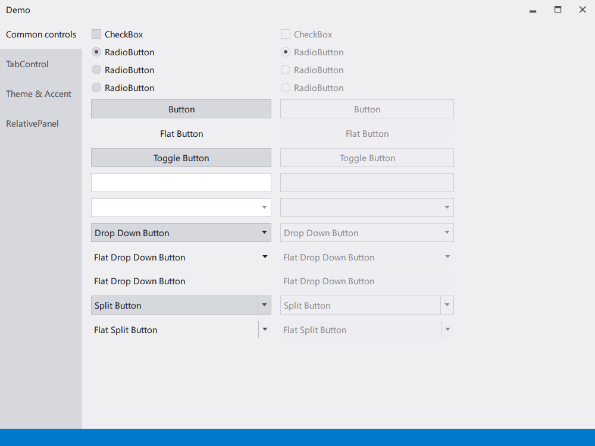
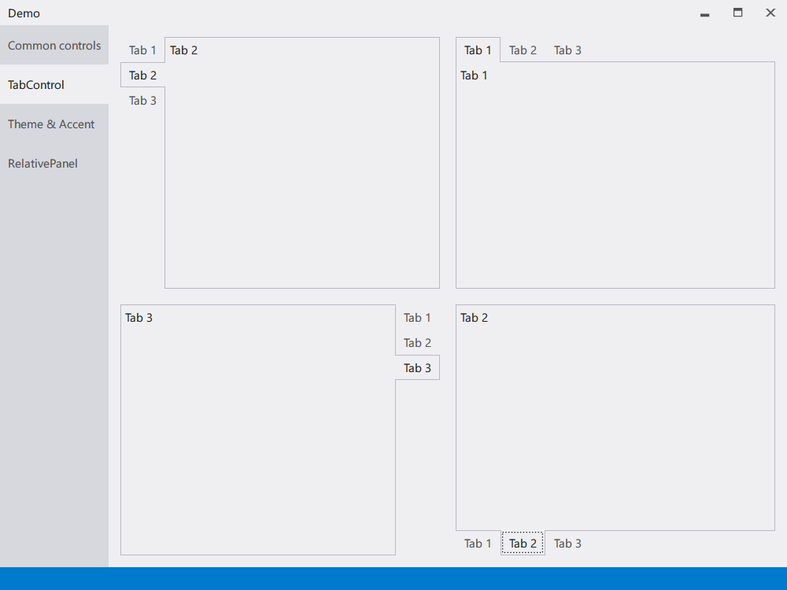
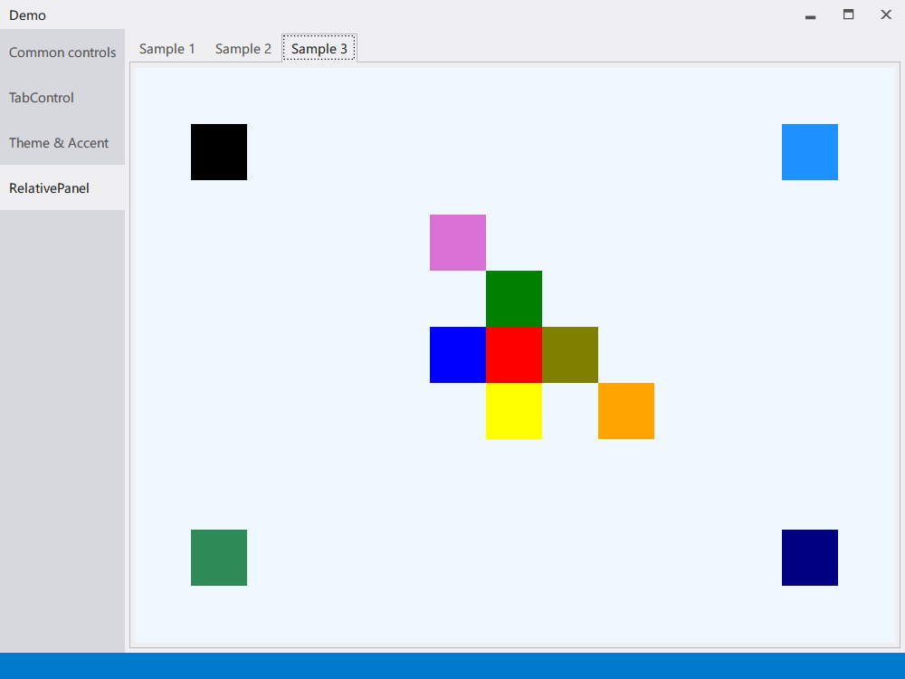

# Sakuno.UserInterface

[](https://ci.appveyor.com/project/KodamaSakuno/Sakuno-UserInterface)
[](https://www.nuget.org/packages/Sakuno.UserInterface)
[](https://www.nuget.org/packages/Sakuno.UserInterface)
[](./LICENSE.md)

My framework for WPF apps.

## Installation

You can install via NuGet Package Manager.

```powershell
PM> Install-Package Sakuno.UserInterface
```

## Screenshots






Layout Source: https://asp-net-example.blogspot.com/2017/01/uwp-understanding-relativepanel.html

## Licence

[MIT License (MIT)](./LICENSE.md)
