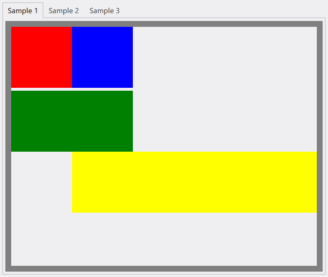

# Sakuno.UserInterface

[](https://ci.appveyor.com/project/KodamaSakuno/Sakuno-UserInterface)
[](https://www.nuget.org/packages/Sakuno.UserInterface)
[](https://www.nuget.org/packages/Sakuno.UserInterface)
[](./LICENSE.md)

My framework for WPF apps.

## Quick Start

1. Install package via NuGet Package Manager.

```powershell
PM> Install-Package Sakuno.UserInterface
```

2. Change your App class from Application to [Themed App](./src/Sakuno.UserInterface/ThemedApp.cs).

  * You can change theme and accent in constructor.

3. Change your window class(es) from Window to [ModernWindow](./src/Sakuno.UserInterface/Controls/ModernWindow.cs).

4. Compile and run your program.

## Special Features

### RelativePanel



Layout Source: https://docs.microsoft.com/en-us/uwp/api/windows.ui.xaml.controls.relativepanel#remarks


Layout Source: https://asp-net-example.blogspot.com/2017/01/uwp-understanding-relativepanel.html

### BBCodeBlock


## Other Screenshots


## Licence

[MIT License (MIT)](./LICENSE.md)
